# FPGA Internship Assessment – RTL Simulation & Logic Synthesis
**VSD Open EDA Lab | 12-Hour Assessment Submission**

---

## Repository Structure

```
├──RTL_Simulation/
│   ├── good_mux/
│   │   ├── good_mux.v
│   │   ├── tb_good_mux.v
│   │   └── waveforms/
│   │       ├── GTK_SIM1.png
│   │       └── GTK_SIM2.png
│   ├── dff_asyncres/
│   │   ├── dff_asyncres.v
│   │   ├── tb_dff_asyncres.v
│   │   └── waveforms/
│   │       ├── GTK_ASYRES_SIM1.png
│   │       ├── GTK_ASYRES_SIM2.png
│   │       └── GTK_ASYRES_SIM3.png
│   ├── dff_async_set/
│   │   ├── dff_async_set.v
│   │   ├── tb_dff_async_set.v
│   │   └── waveforms/
│   │       ├── GTK_ASY_SET_S1.png
│   │       └── GTK_ASY_SET_S2.png
│   └── dff_syncres/
│       ├── dff_syncres.v
│       ├── tb_dff_syncres.v
│       └── waveforms/
│           ├── GTK_SYRES_S1.png
│           └── GTK_SYRES_S2.png
├──Synthesis/
│   ├── good_mux/
│   │   ├── mux.ys
│   │   ├── block_goodmux.png
│   │   ├── synth_sim1.png
│   │   └── synth_sim2.png
│   ├── multiple_modules/
│   │   ├── multiple_modules.v
│   │   ├── multi_hier.ys
│   │   ├── multi_flat.ys
│   │   ├── block_multi_hier.png
│   │   ├── block_multi_flat.png
│   │   ├── block_subm1.png
│   │   ├── synth_multi_hier_res1.png
│   │   ├── synth_multi_hier_res2.png
│   │   └── synth_multi_flat_res.png
│   ├── mul2_mul8/
│   │   ├── mult_2.v
│   │   ├── mult_8.v
│   │   ├── mult2.ys / mult8.ys
│   │   ├── block_mult2.png
│   │   ├── block_mult8.png
│   │   ├── synth_mult2_res.png
│   │   └── synth_mult8_res.png
│   └── dff_variants/
│       ├── asyres.ys / asyset.ys
│       ├── block_asyres.png
│       ├── block_asyset.png
│       ├── block_syncres.png
│       ├── synth_asynres_res.jpeg
│       ├── synth_asyn_setres.jpeg
│       └── synth_syncres_res.png
└── README.md
```

---

## Tools Used

| Tool | Purpose |
|---|---|
| **Icarus Verilog (iverilog)** | RTL compilation and simulation |
| **GTKWave** | Waveform viewer for `.vcd` dumps |
| **Yosys** | Logic synthesis |
| **SKY130 PDK** (`sky130_fd_sc_hd__tt_025C_1v80.lib`) | Standard cell library for synthesis |

---

## Day 1 – RTL Simulation & Waveform Analysis

### Overview

The objective of assesment was to execute all labs independently using provided video guidance. Simulating using Icarus Verilog, and analyze the resulting signal waveforms in GTKWave. Each design is compiled and simulated using the following flow:

```bash
iverilog -o sim_out <module>.v <testbench>.v
vvp sim_out
gtkwave <dumpfile>.vcd
```
### Waveform Generation
We use a waveform viewer GTKWave to observe functionality of modules. However, GTKWave cannot monitor a running simulation live. Instead we use $dumpfile and $dumpvars commands to record every signal change in .vcd file (Value Change Dump). We put .vcd file in $dumpfile command and then we put testbench in .var command which tells simulator like which signal we need to record.

### Module 1 – 2:1 Multiplexer (`good_mux`)

#### RTL Code

```verilog
module good_mux (input i0, input i1, input sel, output reg y);
  always @ (*) begin
    if (sel)
      y <= i1;
    else
      y <= i0;
  end
endmodule
```

**Design Description:**  
Multiplexer with 2 inputs and a 1-bit select line.
If `sel=0`, then the output `y` takes the value of `i0`.
If `sel=1`, then the output `y` takes the value of `i1`.
Since the sensitivity list is an `always @(*)`, this block of code is purely combinational.

#### Testbench

```verilog
`timescale 1ns / 1ps
module tb_good_mux;
  reg i0, i1, sel;
  wire y;

  good_mux uut (.sel(sel), .i0(i0), .i1(i1), .y(y));

  initial begin
    $dumpfile("tb_good_mux.vcd");
    $dumpvars(0, tb_good_mux);
    sel = 0; i0 = 0; i1 = 0;
    #300 $finish;
  end

  always #75  sel = ~sel;
  always #10  i0  = ~i0;
  always #55  i1  = ~i1;
endmodule
```

**Stimulus Explanation:**  
Here testbench is mapped with main module and working flow is:
- `i0` toggles every 10 ns → fast toggling input  
- `i1` toggles every 55 ns → slower toggling input  
- `sel` toggles every 75 ns → selects between the two inputs every half-period  
- Total simulation time: 300 ns

---

#### Waveform Analysis – GTK_SIM1 (Marker at 121 ns, `sel = 1`)


At **t = 121 ns**, the marker is added for `sel = 1`. For that part of the waveform:

- **`sel` becomes HIGH at t = 75 ns** (after the 75 ns interval), which switches the mux operation for `i1`.
- **`i1 = 0`** at that time (i1 changed from 1 to 0 at t = 110 ns); thus, **`y = 0`**.
- At times when `sel = 0`, meaning before t = 75 ns, `y` had tracked `i0` with absolute accuracy; we can easily note that `y` tracks `i0`, and the exact same rapid 10 ns toggling can be observed in the waveform to the left of the marker.
- After t = 75 ns, when `sel` becomes HIGH, `y` ceases tracking `i0`, and begins tracking `i1` instead; the lower frequency of `y` after that point makes this clear, as `y` starts switching at 55 ns intervals.
- As expected by the instantaneous effect of the change in `sel`, the transition at the edge of the marker verifies the changing mux input, i.e., `i0` to `i1`.

---

#### Waveform Analysis – GTK_SIM2 (Marker at 64900 ps, `sel = 0`)

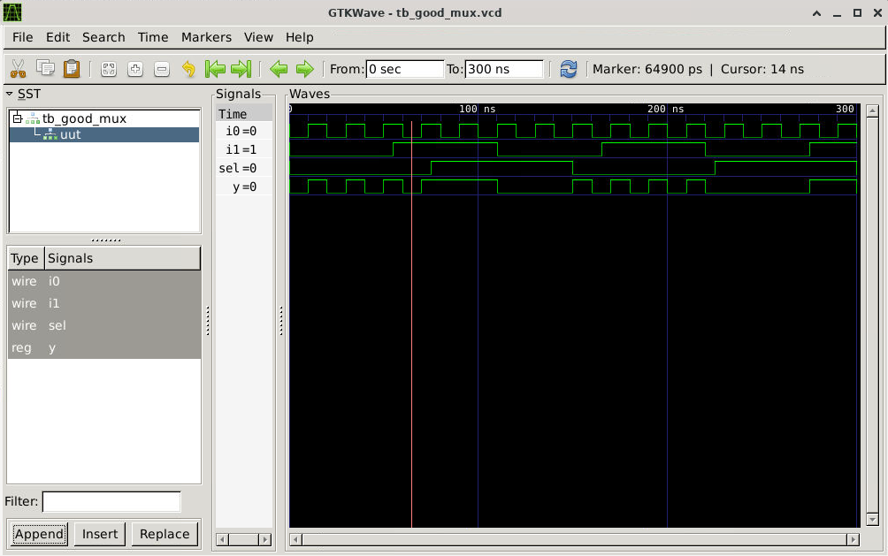

At **t ≈ 65 ns**, `sel = 0`, and therefore `y` is tracing `i0`:

- **`i1 = 1`**: for the majority of this early time period (`i1` starts out at 0, switching to 1 at 55 ns).
- **`i0`** is oscillating rapidly with a period of 10 ns; `y` follows suit in its `sel = 0` segment.
- **t ≈ 150 ns**: `sel` switches to HIGH (second blue vertical marker); `y` switches to trace `i1` at exactly this point. Because `i1 = 1`, `y` switches to 1 and holds until another change to `i1`.
- Two blue cursors (at 100 ns and 150 ns) mark the period during which `sel` is HIGH, allowing us to distinguish the behavior of `y` here (tracing `i1`) from that in the other segments (when `sel = 0`).

**Observation:** `y` always reacts immediately to the value of `sel` and the corresponding correct `i`; the multiplexer does not exhibit any glitches, so the RTL works fine.

---

### Module 2 – D Flip-Flop with Asynchronous Reset (`dff_asyncres`)

#### RTL Code

```verilog
module dff_asyncres (input clk, input async_reset, input d, output reg q);
  always @ (posedge clk, posedge async_reset) begin
    if (async_reset)
      q <= 1'b0;
    else
      q <= d;
  end
endmodule
```

**Design Description:**  
D Flip-Flop with active high asynchronous reset. The sensitivity list will include both `posedge clk` and `posedge async_reset`, which implies:
- Whenever `async_reset` is HIGH, the output q will be **instantly set to 0** irrespective of what the clock is doing.
- Whenever `async_reset` is LOW, q will capture the value of `d` whenever there is a rising edge of clock.
- Asynchronous reset is that reset which does not care about the clock and happens instantaneously.

#### Testbench

```verilog
`timescale 1ns / 1ps
module tb_dff_asyncres;
  reg clk, async_reset, d;
  wire q;

  dff_asyncres uut (.clk(clk), .async_reset(async_reset), .d(d), .q(q));

  initial begin
    $dumpfile("tb_dff_asyncres.vcd");
    $dumpvars(0, tb_dff_asyncres);
    clk = 0; async_reset = 1; d = 0;
    #3000 $finish;
  end

  always #10  clk         = ~clk;          // 20 ns clock period
  always #23  d           = ~d;
  always #547 async_reset = ~async_reset;  // reset toggles every 547 ns
endmodule
```

**Stimulus Explanation:**  
- Clock period: 20 ns (50 MHz).  
- `d` toggles every 23 ns — not aligned to clock, so it captures arbitrary data.  
- `async_reset` starts HIGH (reset active), and toggles every 547 ns, creating long stretches of reset-active and reset-inactive regions.

---

#### Waveform Analysis – GTK_ASYRES_SIM1 (Marker at 1596500 ps / ~1597 ns)


The following figure illustrates the transient region near **t = 1596 ns**, where `async_reset` **releases**:

- For the first half of the time interval shown in this figure, `async_reset = 1`. At this stage, `q` will be firmly driven to logic **0**, regardless of the states of `d` and `clk`; it is the asynchronous reset taking place.
- Around **t = 1600 ns** (as indicated by the red mark in the plot below on its right side), `async_reset` goes LOW. Starting from here, the behavior of the DFF is expected; it captures the value of `d` at the next rising edge of `clk`.
- Since **`d = 1`** at the moment when async reset deasserts, `q` jumps immediately to logic 1 upon the first positive edge after `async_reset = 0`, which can be observed as the rising edge of `q` in the right-hand part of the diagram.
- Hence, the release of the reset is clear, and the flip-flop is capable of capturing `d` again right away.

---

#### Waveform Analysis – GTK_ASYRES_SIM2 (Marker at 1641 ns — zoomed detail)

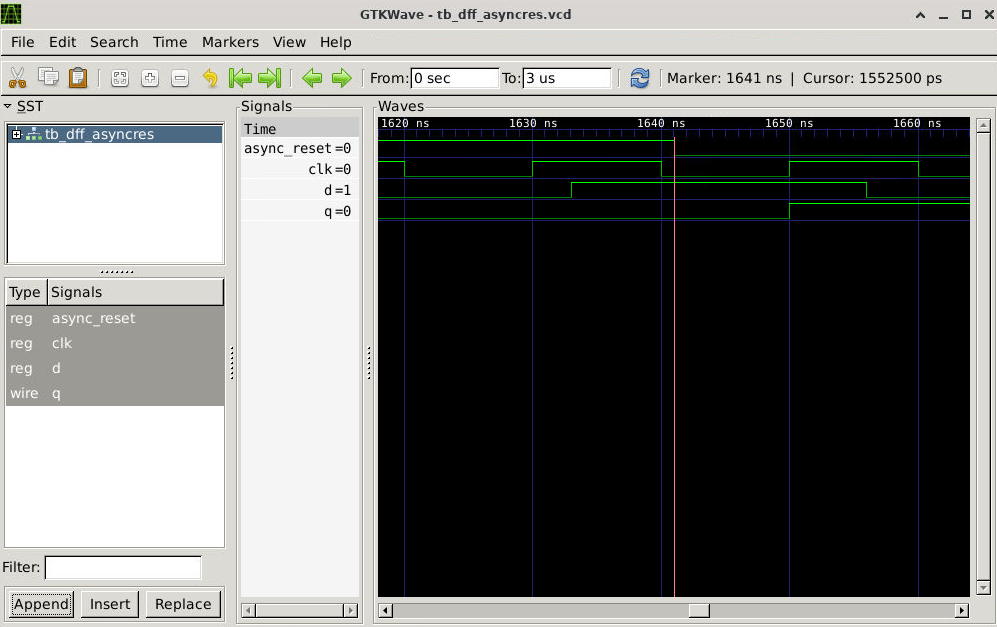

Below is an expanded view of the **1620–1660 ns** period with `async_reset = 0` (de-asserted reset):

- `d` changes state halfway through the period (LOW to HIGH @ 1632 ns, then HIGH to LOW @ 1655 ns).
- Every **10ns**, there's a transition in `clk`.
- `q` changes state **only when there is a rising edge of the clk**. Notice how `q` stays low until `clk` goes high, after which it assumes the value of `d`.
- The red marker is placed right after a positive `clk` edge with `d = 1` at **1641 ns**, indicating that `q` has successfully latched the value of `1`.
- The above zoomed picture proves the correct operation of the setup/hold timing relationship. The reason being `d` remains stable before the clock edges.

---

#### Waveform Analysis – GTK_ASYRES_SIM3 (Marker at 1094 ns — reset assertion)

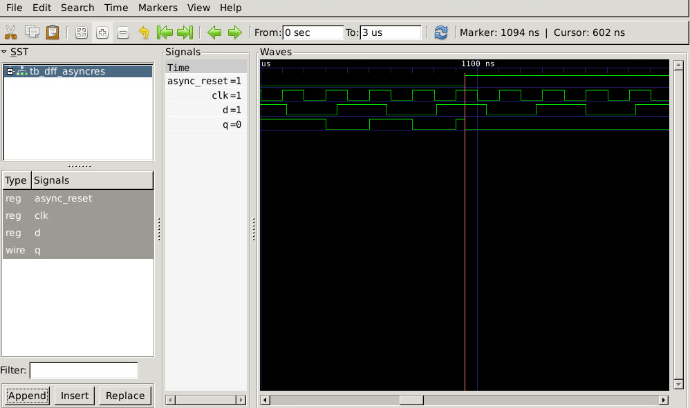

This figure captures the point when `async_reset` goes **HIGH** (asserted) roughly around **t = 1094 ns** (marked red):

- Prior to this point, `async_reset = 1` (asserted right from the beginning of the simulation process), therefore `q = 0` for this entire initial interval of the wave form displayed.
- Around **t = 1094 ns**, the transition of the `async_reset` signal occurs. Despite the `d` input changing states and `clk` pulsing, `q` does **not change** in response to an asserted reset – `q = 0` without being affected by the clock pulses.
- Past this point (around blue cursor at ~1100 ns), we see that `q` starts to respond to changes of `d` at clock edges because of reset being released (`t = 1094 ns`).
- It is clear from this image that the **asynchronous nature** of `async_reset` is perfectly illustrated here since `q` did not wait for the next rising clock edge to be changed – it was changed on the spot!

---

### Module 3 – D Flip-Flop with Asynchronous Set (`dff_async_set`)

#### RTL Code

```verilog
module dff_async_set (input clk, input async_set, input d, output reg q);
  always @ (posedge clk, posedge async_set) begin
    if (async_set)
      q <= 1'b1;
    else
      q <= d;
  end
endmodule
```

**Design Description:**  
This is an inverted version of the asynchronous reset DFF. If the signal `async_set` becomes HIGH, then `q` will be **set to 1 immediately** without regard for the clock signal. However, when the signal `async_set` is LOW, `q` will register `d` upon each rising clock edge. As opposed to the previous example, in this case `q` is set to 1 rather than 0.

#### Testbench

```verilog
`timescale 1ns / 1ps
module tb_dff_async_set;
  reg clk, async_set, d;
  wire q;

  dff_async_set uut (.clk(clk), .async_set(async_set), .d(d), .q(q));

  initial begin
    $dumpfile("tb_dff_async_set.vcd");
    $dumpvars(0, tb_dff_async_set);
    clk = 0; async_set = 1; d = 0;
    #3000 $finish;
  end

  always #10  clk       = ~clk;
  always #23  d         = ~d;
  always #547 async_set = ~async_set;
endmodule
```

The testbench is structurally identical to the async reset testbench — same timing parameters — which allows direct behavioral comparison between the two modules.

---

#### Waveform Analysis – GTK_ASY_SET_S1 (Marker at 570 ns)

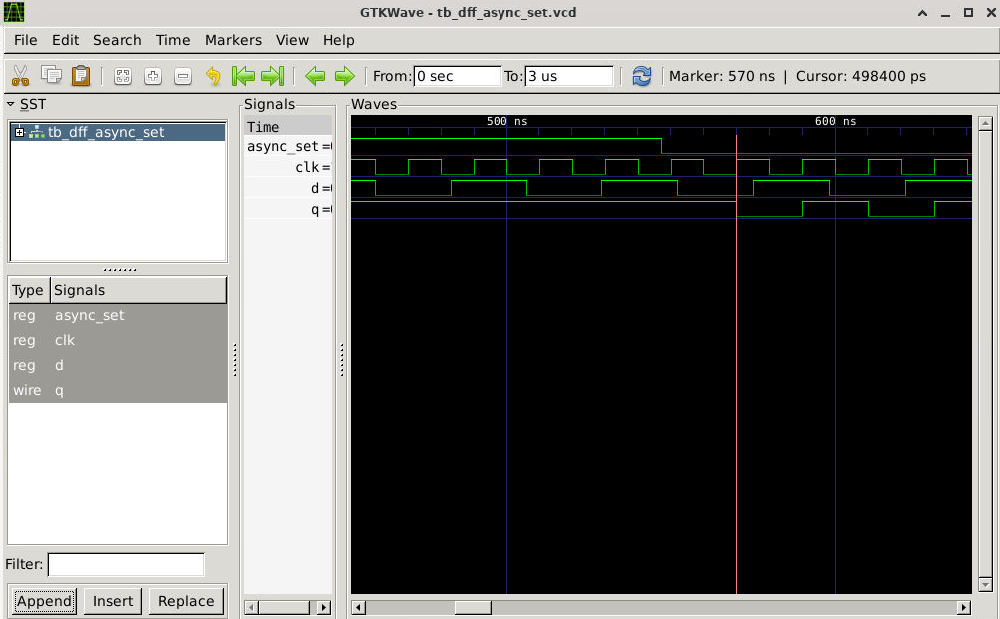

The above image illustrates the section from **500 to 650 ns** during which the **deassert** of the signal `async_set` takes place:

- On the left side, `async_set = 1` implies that `q` will be kept HIGH by virtue of being in an asynchronous condition where nothing else overrides it despite the continuous toggle of `d` and the presence of clk pulses.
- Around **t = 547 ns**, the signal `async_set` switches from HIGH to LOW (deasserting).
- The point at **570 ns** is selected just after this deassert. If we look at the signal `q` after this point, we can see that `q` was HIGH due to the assertion of the set, but because `d = 0` at the next positive edge of clk, `q` becomes LOW.

---

#### Waveform Analysis – GTK_ASY_SET_S2 (Marker at 1094 ns — async set assertion)

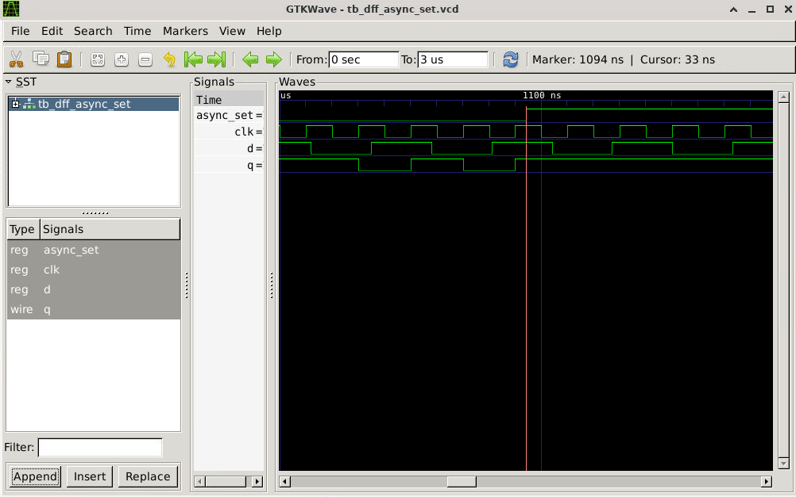

The image below presents the range of **1050-1200+ ns** when `async_set` is **HIGH** again:

- Until time **1094 ns** marked by the red line, `async_set = 0`, and `q` changes states along with `clk` and `d`. You can see `q` transitioning from HIGH to LOW and vice versa.
- Starting from the point when `async_set = 0`, **instantly** at **1094 ns** (`async_set` is raised), `q` is **set to 1**. This is quite evident by `q` raising during the middle of the clock cycle.
- From that moment onward, `q` keeps being equal to 1 all the way up to the point when `async_set` is de-asserted.
- **Takeaway point:** The response of the signal to mid-cycle assertion, i.e., setting `q` to 1 instantly without waiting for a clock cycle, is the key distinguishing feature of the asynchronous set, which this diagram illustrates perfectly.

---

### Module 4 – D Flip-Flop with Synchronous Reset (`dff_syncres`)

#### RTL Code

```verilog
module dff_syncres (input clk, input async_reset, input sync_reset, input d, output reg q);
  always @ (posedge clk) begin
    if (sync_reset)
      q <= 1'b0;
    else
      q <= d;
  end
endmodule
```

**Design Description:**  
In this DFF, the sensitivity list contains **just one item, `posedge clk`**, and there is no asynchronous input signal. The `sync_reset` condition is checked **on the rising edge of the clock signal**. In case `sync_reset` equals 1 at the moment the edge of the clock signal occurs, the value `q` is set to 0; otherwise, the value of `d` is copied to `q`. Resetting can only occur on the edges of the clock signal; that's the core difference between the asynchronous implementations.

#### Testbench

```verilog
`timescale 1ns / 1ps
module tb_dff_syncres;
  reg clk, sync_reset, d;
  wire q;

  dff_syncres uut (.clk(clk), .sync_reset(sync_reset), .d(d), .q(q));

  initial begin
    $dumpfile("tb_dff_syncres.vcd");
    $dumpvars(0, tb_dff_syncres);
    clk = 0; sync_reset = 0; d = 0;
    #3000 $finish;
  end

  always #10  clk        = ~clk;
  always #23  d          = ~d;
  always #113 sync_reset = ~sync_reset; // shorter period than async versions
endmodule
```

Notable difference: `sync_reset` toggles every 113 ns (much more frequently than the 547 ns in async variants), creating many visible reset/normal alternation windows across the 3 µs simulation.

---

#### Waveform Analysis – GTK_SYRES_S1 (Marker at 565 ns — sync reset active)

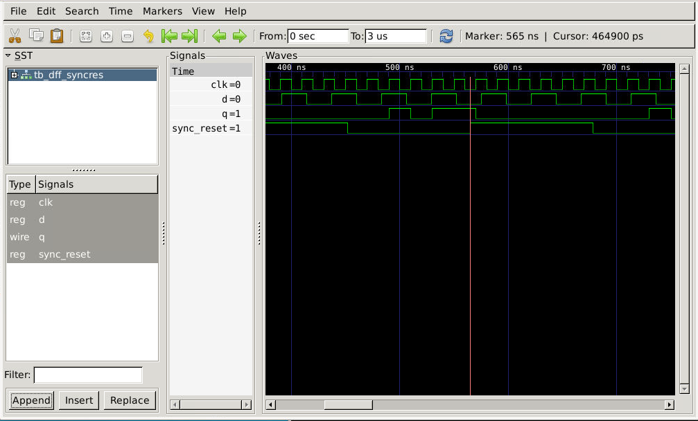

This scope window spans **400-750 ns**, and there are several `sync_reset` cycles:

- **`sync_reset = 1`** in the first window visible (about 400–565 ns). Throughout this interval, `q` is set to 0 **each clock edge** – it doesn't happen upon rising of `sync_reset` immediately, but on the next rising clock edge.
- **`d`** toggles in this window, but has no effect since every clock edge observes `sync_reset = 1`, and `q` is repeatedly reset to 0.
- In the **red mark (565 ns)**, `sync_reset` gets deasserted. But observing closely, `q` does **not jump at the exact mark of 565 ns** – it needs to wait for the next rising edge of `clk` to capture `d`.
- Beyond the mark, `sync_reset = 0` and `q` follows `d`'s values on each clock edge, continuing toggling.
- **Async behavior:** In the case of asynchronous resetting, `q` jumps to 0 the moment `sync_reset` goes HIGH, regardless of the clock edges.

---

#### Waveform Analysis – GTK_SYRES_S2 (Marker at 1130 ns)


This window applies to the **1050 – 1250 ns** period where `sync_reset = 0`:

- `sync_reset` remains LOW through this entire window (it was de-asserted earlier than this window starts), so `q` operates in data capture state.
- `d = 1` for most of the time in this window (with brief transitions only), and `q` samples the value of `d` at rising edges of `clk`.
- At the **red mark (1130 ns)**: `clk` is rising; therefore `d = 1`; hence `q` samples 1 and stays HIGH.
- It's easy to notice that transitions of `q` always occur in correspondence with rising edges of `clk`. For example, `q` does not change its state in between rising and falling edges of `clk`.

**Critical Comparison — Async vs Sync Reset:**

| Property | `dff_asyncres` / `dff_async_set` | `dff_syncres` |
|---|---|---|
| Sensitivity list | `posedge clk, posedge reset/set` | `posedge clk` only |
| Reset/Set response | Immediate (mid-cycle) | Only at next clock rising edge |
| Waveform indicator | `q` changes without clock edge | `q` only changes on clock edge |
| Standard cell | `dfrtp_1` / `dfstp_2` | `dfxtp_1` + `nor2b_1` |

---

---

## Logic Synthesis & Optimization

### Overview

The work is aimed at performing RTL design synthesis with **Yosys** using **SKY130 HD standard cell library** (`sky130_fd_sc_hd__tt_025C_1v80.lib`). RTL design synthesis involves transforming behavioral Verilog code into a gate-level netlist consisting of standard cells. The `show` command within Yosys creates a graphic representation of the resulting netlist.

General Yosys flow:
```
read_verilog <module>.v
synth -top <module>
dfflibmap -liberty ../lib/sky130_fd_sc_hd__tt_025C_1v80.lib
abc -liberty ../lib/sky130_fd_sc_hd__tt_025C_1v80.lib
clean
show
stat -liberty ../lib/sky130_fd_sc_hd__tt_025C_1v80.lib
write_verilog -noattr <netlist>.v
```

---

### Synthesis 1 – `good_mux`

**Yosys Script (`mux.ys`):**
```
read_verilog good_mux.v
hierarchy -check -top good_mux
proc; opt;
synth -top good_mux 
dfflibmap -liberty ../lib/sky130_fd_sc_hd__tt_025C_1v80.lib
techmap; opt;
abc -liberty ../lib/sky130_fd_sc_hd__tt_025C_1v80.lib
show
stat -liberty ../lib/sky130_fd_sc_hd__tt_025C_1v80.lib
write_verilog -noattr mux_netlist.v
```

#### Synthesized Schematic

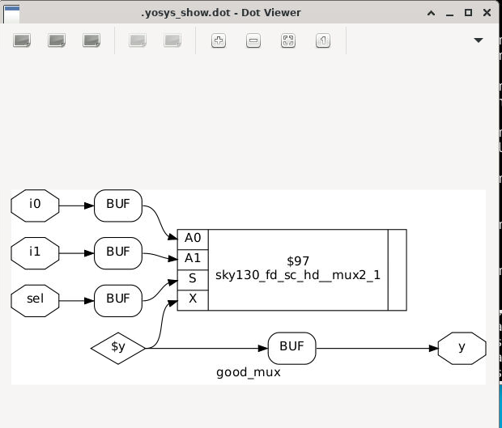

**Schematic Analysis:**  
- The `i0`, `i1`, and `sel` lines go through **input buffers (BUF)**, which are always part of the cell libraries due to signal integrity requirements.
- The buffered signals act as the inputs of the **`sky130_fd_sc_hd__mux2_1`** cell (`$97`), which is a native two-input mux cell of the SKY130 library that contains ports A0 (`i0`), A1 (`i1`), S (`sel`), and X (output).
- The output of this cell goes through one final **output buffer (BUF)** before being sent to the `y` pin.
- Since there was only one MUX2 in Yosys, no decomposition of the logic cells was necessary, as the SKY130 library has a built-in mux cell type.

#### Gate-Level Simulation Waveforms

**Post-Synthesis Simulation 1 (`synth_sim1.png` — `sel = 0`):**

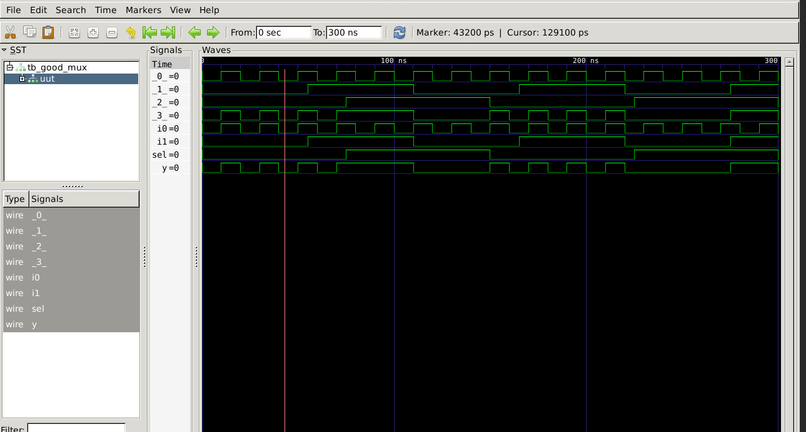

Simulation of the post-synthesis netlist involves the use of internal wires `_0_`, `_1_`, `_2_`, `_3_` (produced by Yosys for net connections within the BUF cells and the mux cell). When `sel = 0`:
- The behavior of `y` follows `i0` accurately – the toggling signal pattern of 10 ns is reproduced.
- There are intermediate states of the internal wires observed during propagation through the BUF cells, and they settle correctly.
- The behavior of the `y` output agrees with the RTL simulation, validating that the RTL and the synthesized netlist are **functionally equivalent**.

**Post-Synthesis Simulation 2 (`synth_sim2.png` — `sel = 0` ending, transitioning to `sel = 1`):**

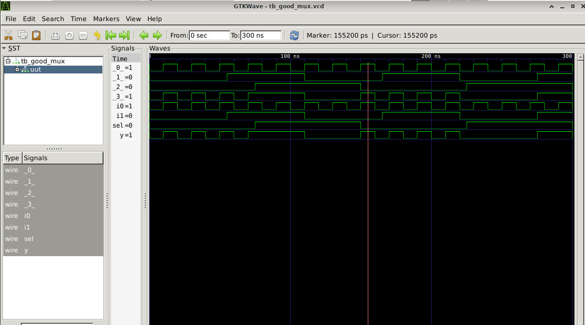

The `sel` wire being 0 in the initial part, the `y` follows `i0`, which is 1 at the beginning of this waveform view. Around t = 150 ns, `sel` transitions HIGH, and `y` begins to follow `i1`. Once again, the internal wiring demonstrates the propagation along the BUFs. Thus, the netlist generated from RTL has been verified with no functional errors made — **RTL-to-gates synthesis is validated**.

---

### Synthesis 2 – `multiple_modules` (Hierarchical vs Flat Synthesis)

#### Module Code

```verilog
module sub_module1 (input a, input b, output y);
  assign y = a & b;   // AND gate
endmodule

module sub_module2 (input a, input b, output y);
  assign y = a | b;   // OR gate
endmodule

module multiple_modules (input a, input b, input c, output y);
  wire net1;
  sub_module1 u1 (.a(a), .b(b), .y(net1));  // net1 = a & b
  sub_module2 u2 (.a(net1), .b(c), .y(y)); // y = (a & b) | c
endmodule
```

**Design Description:**  

The circuitry uses all the inputs of the system ($a$, $b$, and $c$) and includes an internal wire to connect different modules inside the system. After that, the designer instantiates two modules of the AND and OR gates on the virtual breadboard. Lastly, the top module connects all elements together. Input variables $a$ and $b$ are connected to the AND gate input, while the output of the AND gate is connected to the internal wire to transfer its value to the first input of the OR gate. The second input of the OR gate is connected to the system input $c$. The output of the OR gate is connected to the final output of the whole system.

---

#### Hierarchical Synthesis

**Script (`multi_hier.ys`):**
```
read_verilog multiple_modules.v
hierarchy -check -top multiple_modules
proc; opt;
synth -top multiple_modules
...
show multiple_modules
```

**Synthesized Schematic (Hierarchical):**

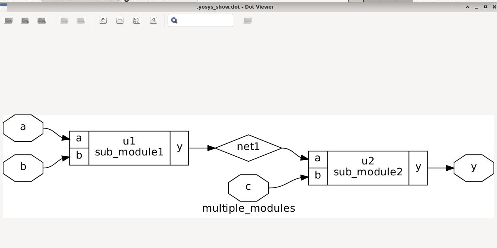

Module boundaries are retained during hierarchical synthesis. The diagram illustrates:
- `a` and `b` are inputs to `u1 (sub_module1)` as a black box, meaning that the AND function is implemented within `u1`.
- The output from `u1` is called `net1`. It connects to `u2 (sub_module2)`, together with `c`.
- `u2` outputs the value of `y`.
- Sub-modules are depicted using boxes.

**Synthesis Statistics (Hierarchical):**

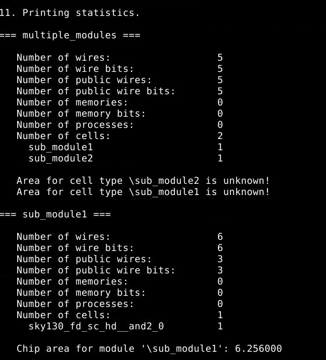

```
=== multiple_modules ===
  Number of cells: 2    (sub_module1: 1, sub_module2: 1)
  [Area unknown — sub-modules not yet expanded to standard cells]

=== sub_module1 ===
  Number of cells: 1    sky130_fd_sc_hd__and2_0
  Chip area: 6.256000 µm²

=== sub_module2 ===  [from design hierarchy report]
  Mapped to sky130_fd_sc_hd__or2_0
```

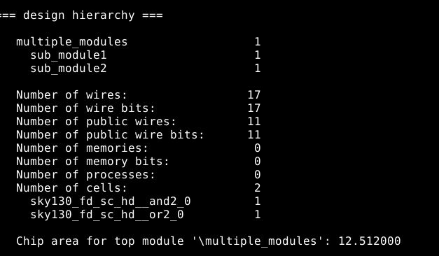

```
=== design hierarchy ===
  multiple_modules: 1
    sub_module1: 1
    sub_module2: 1
  Total cells: 2    (and2_0, or2_0)
  Chip area for top module: 12.512000 µm²
```

**Sub-module 1 Synthesized Schematic:**

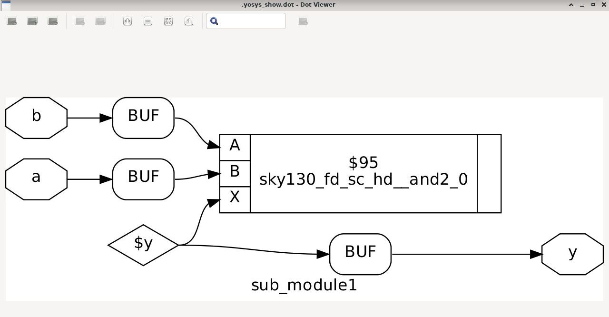

`sub_module1` synthesizes to a single `sky130_fd_sc_hd__and2_0` cell (2-input AND gate). Inputs `a` and `b` are buffered, feed into the AND cell, and the output is buffered before reaching `y`. Minimal and optimal.

---

#### Flat Synthesis

**Script (`multi_flat.ys`):**
```
read_verilog multiple_modules.v
hierarchy -check -top multiple_modules
proc; opt;
synth -top multiple_modules -flatten   # <-- -flatten flag
...
show multiple_modules
```

**Synthesized Schematic (Flat):**

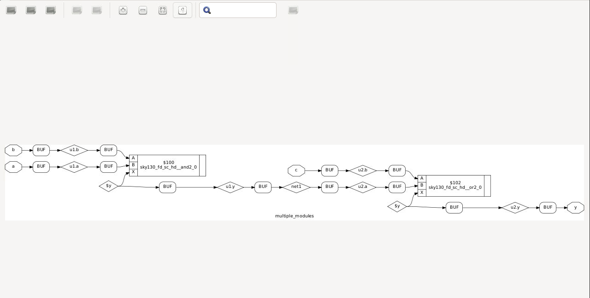

With the `-flatten` flag, Yosys **dissolves all module boundaries** and exposes every gate in a single flat netlist. The schematic now shows:
- `b` → BUF → `u1.b` → BUF → input B of `sky130_fd_sc_hd__and2_0` (`$100`)
- `a` → BUF → `u1.a` → BUF → input A of the same AND cell
- AND cell output → BUF → `u1.y` → BUF → `net1` → BUF → `u2.a` → BUF → input A of `sky130_fd_sc_hd__or2_0` (`$102`)
- `c` → BUF → `u2.b` → BUF → input B of OR cell
- OR output → BUF → `u2.y` → BUF → `y`

**Flat Synthesis Statistics:**

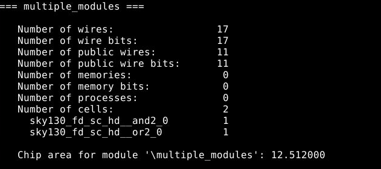

```
=== multiple_modules ===
  Number of cells: 2
    sky130_fd_sc_hd__and2_0:  1
    sky130_fd_sc_hd__or2_0:   1
  Chip area: 12.512000 µm²
```

**Hierarchical vs Flat — Key Differences:**

| Aspect | Hierarchical | Flat |
|---|---|---|
| Module structure | Sub-modules preserved as black boxes | All boundaries dissolved |
| Schematic view | Clean, modular, abstract | Detailed, gate-level |
| Area | Same (12.512 µm²) | Same (12.512 µm²) |
| Use case | Large designs, IP reuse, modular debugging | Timing closure, cross-boundary optimization |
| Optimization scope | Within each module | Across all module boundaries |

**Why use flat synthesis?** With flat design (using synth -flatten in Yosys for instance), all these arbitrary barriers disappear, opening the whole circuit as one big block of logic. This enables the synthesis algorithm to apply radical optimization techniques that it could not previously apply. The flat synthesis algorithm identifies redundancy, eliminates one copy and shares its value with both destinations. 


---

### Synthesis 3 – Special Case: `mul2` and `mult8` (No Standard Cells Used)

#### RTL Code

```verilog
module mul2 (input [2:0] a, output [3:0] y);
  assign y = a * 2;
endmodule

module mult8 (input [2:0] a, output [5:0] y);
  assign y = a * 9;
endmodule
```

---

#### `mul2` — Multiply by 2

**Design Description:**  
Multiplying a 3-bit number by 2 is equivalent to a left-shift by 1 bit. In binary:
- `a = {a[2], a[1], a[0]}`
- `a * 2 = {a[2], a[1], a[0], 0}` — simply append a 0 at the LSB.
- This is a **pure wiring operation**: `y[3:1] = a[2:0]` and `y[0] = 1'b0`.

No logic gates are required — this is just bit-position mapping.

**Synthesized Schematic:**

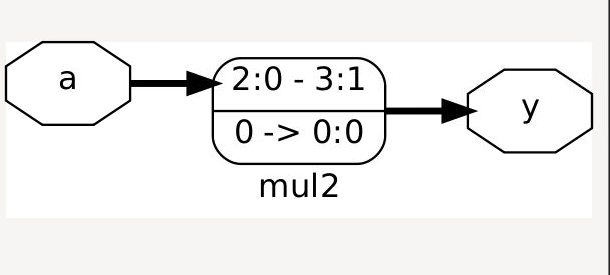

The above diagram represents only the **wiring connections** where the three bits of the input signal `a` (2:0) are wired directly to bits 3:1 of the output signal `y`, while bit 0 of `y` is connected to the value 0. It can be expressed as the pass-through mapping (2:0 - 3:1, 0 -> 0:0).

**Synthesis Statistics:**

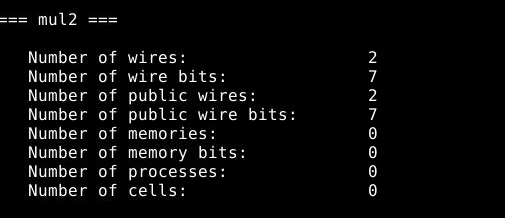

```
=== mul2 ===
  Number of wires:        2
  Number of wire bits:    7
  Number of cells:        0     ← Zero standard cells!
  Chip area:              0 µm²
```

**Observation:** Zero cells and zero area – Yosys eliminated all hardware from the design. Multiplying by 2 requires only **net routing**; there is no logic at all to accomplish this operation. This is a textbook case where synthesis recognizes a pattern in the code that allows for free functionality.

---

#### `mult8` — Multiply by 9

**Design Description:**  
`a * 9 = a * (8 + 1) = (a * 8) + (a * 1) = (a << 3) + a`

So:
- `a * 8` = shift left by 3 = `{a[2:0], 3'b000}` (bits 5:3 of result)
- `a * 1` = just `a` (bits 2:0 of result)
- Adding them: `y = {a[2:0], a[2:0]}` — the 3-bit value `a` simply **repeated twice** to form a 6-bit output!

Mathematically: if `a = 5` (101₂), then `a*9 = 45 = 101101₂ = {5, 5}`. This is another pure wiring trick.

**Synthesized Schematic:**

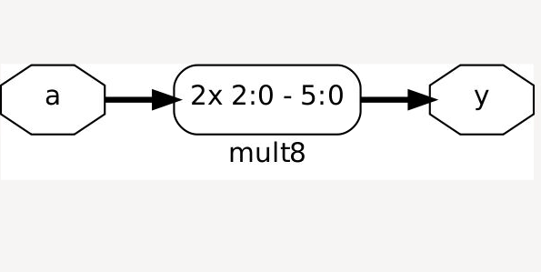

The schematic shows a **2x duplication of the input bus**: `a[2:0]` is wired to both `y[5:3]` and `y[2:0]` directly. Label `2x 2:0 - 5:0` confirms this. No arithmetic hardware needed.

**Synthesis Statistics:**

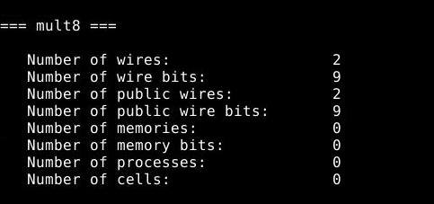

```
=== mult8 ===
  Number of wires:        2
  Number of wire bits:    9
  Number of cells:        0     ← Zero standard cells!
  Chip area:              0 µm²
```

**Key Insight:**Both the `mul2` and `mult8` functions result in zero logic cells due to the fact that their multiplication operations are actually just shifting bits around, which can be done for free in hardware, but costs only wire connections. This is a basic tenet of digital circuit design: always prefer **bit manipulation over arithmetic**.

---

### Synthesis 4 – D Flip-Flops (Async Reset, Async Set, Sync Reset)

All three DFF variants were synthesized using their respective Yosys scripts and the `dfflibmap` command (which maps behavioral flip-flops to specific library flip-flop cells before `abc` handles the surrounding combinational logic).

---

#### `dff_asyncres` — Async Reset DFF

**Yosys Script (`asyres.ys`):**
```
read_verilog dff_asyncres.v
synth -top dff_asyncres
dfflibmap -liberty ../lib/sky130_fd_sc_hd__tt_025C_1v80.lib
abc -liberty ../lib/sky130_fd_sc_hd__tt_025C_1v80.lib
clean; show
stat -liberty ../lib/sky130_fd_sc_hd__tt_025C_1v80.lib
write_verilog -noattr asyres_netlist.v
```

**Synthesized Schematic:**

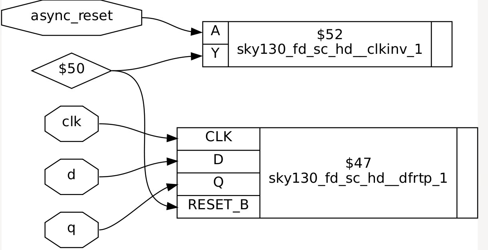

- `async_reset` -> `sky130_fd_sc_hd__clkinv_1` (`$52`): Reset goes through a **clock inverter cell**. This is because the SKY130 `dfrtp` cell uses an active-low reset port (`RESET_B`), hence the active-high `async_reset` must be inverted first before being connected.
- `sky130_fd_sc_hd__dfrtp_1` (`$47`): **D flip-flop with active-low asynchronous reset**; this corresponds most closely to the RTL functionality.
- `clk` and `d` go directly to the `CLK` and `D` ports of the DFF, respectively.
- `q` is directly driven by the output `Q` port of the DFF.

**Synthesis Statistics:**

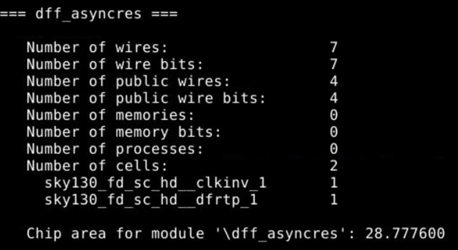

```
=== dff_asyncres ===
  Number of cells: 2
    sky130_fd_sc_hd__clkinv_1:  1   (to invert active-HIGH reset to active-LOW)
    sky130_fd_sc_hd__dfrtp_1:   1   (DFF with async active-LOW reset)
  Chip area: 28.777600 µm²
```
---

#### `dff_async_set` — Async Set DFF

**Yosys Script (`asyset.ys`):**  
read_verilog dff_async_set.v
synth -top dff_async_set
dfflibmap -liberty ../lib/sky130_fd_sc_hd__tt_025C_1v80.lib
abc -liberty ../lib/sky130_fd_sc_hd__tt_025C_1v80.lib
clean; show
stat -liberty ../lib/sky130_fd_sc_hd__tt_025C_1v80.lib
write_verilog -noattr asynset_netlist.v

**Synthesized Schematic:**

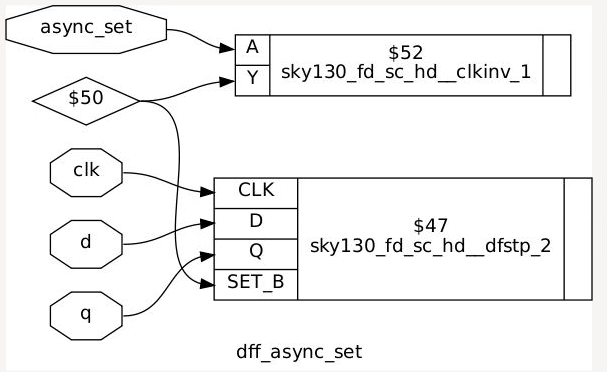

- `async_set` → `sky130_fd_sc_hd__clkinv_1` (`$52`): Similar to the previous reset instance, since this time, the cell has a set input that is active-LOW (`SET_B`).
- The DFF cell is now `sky130_fd_sc_hd__dfstp_2` (`$47`) — a **D flip-flop with asynchronous set input**. Different from the reset DFF cell, this is `dfstp` rather than `dfrtp`.
- `

**Synthesis Statistics:**

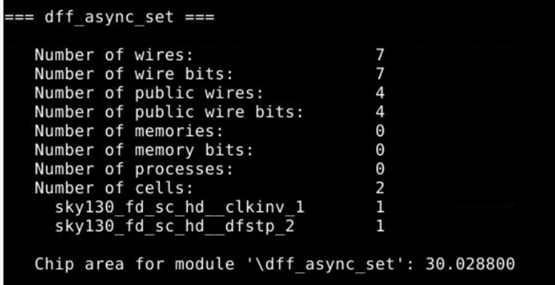

```
=== dff_async_set ===
  Number of cells: 2
    sky130_fd_sc_hd__clkinv_1:  1
    sky130_fd_sc_hd__dfstp_2:   1   (DFF with async active-LOW set)
  Chip area: 30.028800 µm²
```

**Observation:** `The size of dfstp_2 (set DFF) is larger compared to that of dfrtp_1 (reset DFF), which is 30.03 µm² and 28.78 µm², respectively. In addition, there is a difference in the drive strength suffix from “2” and “1.”

---

#### `dff_syncres` — Sync Reset DFF

**Synthesized Schematic:**

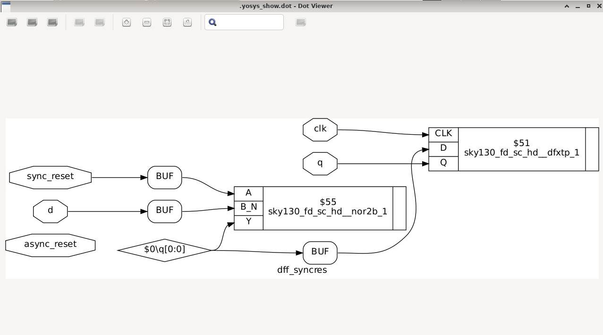

It should be noted that the design shown here differs greatly from other asynchronous designs:
- **There is no separate cell for reset-DFF** because the reset operation is synchronous and thus can be achieved by simply combining a **basic DFF** (`sky130_fd_sc_hd__dfxtp_1`) and combinational circuits feeding into the **D** port.
- `sync_reset` and `d` are inputs of `sky130_fd_sc_hd__nor2b_1` (`$55`), where `A` is set to `sync_reset` and `B_N` to `d`. Here we get `Y =~(sync_reset |~d)=~sync_reset&d`. When combined with the feedback of `q`, the formula becomes: If `sync_reset` is asserted, then `0` goes to D; otherwise, `d` is sent to D.
- `dfxtp_1` is simply an **edge-triggered positive DFF without a reset port**.
  
**Synthesis Statistics:**

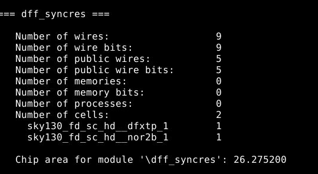

```
=== dff_syncres ===
  Number of cells: 2
    sky130_fd_sc_hd__dfxtp_1:  1   (plain DFF, no built-in reset)
    sky130_fd_sc_hd__nor2b_1:  1   (combinational reset mux logic)
  Chip area: 26.275200 µm²
```

**Critical Synthesis Insight — Why Sync and Async Map Differently:**

| DFF Type | Library Cell | Reset Logic Location |
|---|---|---|
| Async Reset | `dfrtp_1` (has RESET_B pin) | Inside the DFF cell itself |
| Async Set | `dfstp_2` (has SET_B pin) | Inside the DFF cell itself |
| Sync Reset | `dfxtp_1` (plain DFF) | **Combinational logic on D pin** |

Asynchronous control is built into the internal circuit of the flip-flop (since there exists an asynchronous path for the same). Synchronous reset is basically the gated form of `d` where the combinatorial circuit decides between the two values depending upon the value of `sync_reset`. It is this reason that makes synchronous reset DFFs take up **less area** (26.28 µm² against ~29-30 µm²) but introduces delay on the data line through a combinational path.

---

## Summary of Labs Completed

| Lab | Module | Tool | Result |
|---|---|---|---|
| 2:1 MUX RTL simulation | `good_mux` | iverilog + GTKWave | Correct sel-based switching verified |
| MUX synthesis | `good_mux` | Yosys + SKY130 | Mapped to `mux2_1` cell; gate-sim matches RTL |
| Multi-module hierarchical synthesis | `multiple_modules` | Yosys | Sub-modules preserved; `and2_0` + `or2_0`; 12.51 µm² |
| Multi-module flat synthesis | `multiple_modules` | Yosys `-flatten` | Same area, all boundaries dissolved |
| Multiply-by-2 optimization | `mul2` | Yosys | Zero cells — pure wiring (left shift by 1) |
| Multiply-by-9 optimization | `mult8` | Yosys | Zero cells — input bus duplicated |
| Async Reset DFF simulation | `dff_asyncres` | iverilog + GTKWave | Immediate reset response verified |
| Async Set DFF simulation | `dff_async_set` | iverilog + GTKWave | Immediate set response verified |
| Sync Reset DFF simulation | `dff_syncres` | iverilog + GTKWave | Clock-edge-only reset behavior confirmed |
| Async Reset DFF synthesis | `dff_asyncres` | Yosys | `dfrtp_1` + `clkinv_1`; 28.78 µm² |
| Async Set DFF synthesis | `dff_async_set` | Yosys | `dfstp_2` + `clkinv_1`; 30.03 µm² |
| Sync Reset DFF synthesis | `dff_syncres` | Yosys | `dfxtp_1` + `nor2b_1`; 26.28 µm² |

---

## Key Learnings

1. **Combinational vs Sequential Sensitivity:** Incorporating `posedge clk` turns the `always @(*)` into sequential. Incorporating any additional asynchronous signals such as `posedge async_reset` will turn the reset or set operation into asynchronous.

2. **Async vs Sync Reset — Waveform Difference:** The simplest way to differentiate between the two types in GTKWave is to determine whether `q` toggles during a clock cycle due to the control signal. Yes –> asynchronous if Q changes irrespective of clk. `Q` toggles only at clock edges –> synchronous

3. **Synthesis Tool Intelligence:** Multiplication by powers of 2 or by 9 (8 + 1) is recognized as wire routing by Yosys, which generates no standard cell usage. This is a very valuable optimization that reduces area and power costs significantly.

4. **Library Cell Mapping:** Since the SKY130 library implements active-low resets/sets, Yosys automatically includes inverter cells (`clkinv_1`) when synthesizing active-high reset/set RTLs. Knowing this is useful to avoid confusion when viewing gate-level netlists.

5. **Hierarchical vs Flat Synthesis:**  While both approaches result in identical areas and functionalities, flat synthesis allows boundary optimizations not possible without hierarchy. For large designs, hierarchical synthesis is preferable for compiling purposes.

6. **Gate-Level Simulation Validates RTL:** Running the synthesized netlist through the same testbench and comparing waveforms against RTL simulation is the gold standard for confirming synthesis correctness (no equivalence violations introduced by the tool).

---

## Challenges & Observations

- **GTKWave Marker Precision:** Timing analysis should be done precisely or carefully as massive change in output occur at small time to confirm like in asynchronous module, async reset/set changes occur mid-cycle, not on clock edges.
-  **Hierarchical Synthesis Reporting "Area Unknown" for Sub-modules:** The hierarchy in Synthesis is considered by Yosys to be a black box at the highest level, since it cannot sum the areas that are not flattened by it yet. It means that the "top-level stat pass” cannot see inside sub_module1 and sub_module2 without reading them separately."
- **Mult Maps to Zero Cell** The multiplication of a 3-bit number by 9 is equivalent to duplicating those 3 bits next to each other; there is no need for any addition or multiplication circuitry. Yosys exploits this principle and realizes this purely using wiring, without resorting to any standard cells.
- **The Role of dfflibmap:** The optimization tool abc is purely combinational; therefore, it does not understand clock edges, set/reset pin connections, etc., and is unable to connect a flip-flop correctly with a library cell. This implies that we need to use the dfflibmap function before abc to take care of all such sequential aspects of design.
